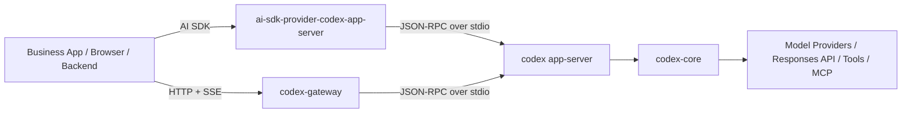

# `codex-gateway` / `ai-sdk-provider-codex-app-server` / `codex app-server` 深度分析

## 1. 分析基线

分析时间：2026-04-20

分析对象：

1. 本地项目 `codex-gateway`
   - 路径：`/Users/jingyang/work/sealos-deploy/codex-gateway`
   - 提交：`be4e22c8e134048bb84e46cb31f55397c5393c04`
2. `pablof7z/ai-sdk-provider-codex-app-server`
   - 仓库：<https://github.com/pablof7z/ai-sdk-provider-codex-app-server>
   - 提交：`d655ec06b4849c633989b6c25af01eab85019ce1`
3. `openai/codex` 的 `codex-rs/app-server`
   - 仓库：<https://github.com/openai/codex/tree/main/codex-rs/app-server>
   - 提交：`b528ff02b6504e8399a5826900ada9a392e6bb48`

规模粗略对比：

| 项目                               | 主要语言       |                            核心代码规模 |                    测试规模 | 结论               |
| ---------------------------------- | -------------- | --------------------------------------: | --------------------------: | ------------------ |
| `codex-gateway`                    | Rust + Node.js |       Rust `2604` 行，旧 Node `1543` 行 |                        很少 | 小型网关/PoC       |
| `ai-sdk-provider-codex-app-server` | TypeScript     |                               `4096` 行 |         仅 1 个显式测试文件 | 中型 SDK 适配器    |
| `codex-rs/app-server`              | Rust           | app-server `32688` 行，core `147997` 行 | app-server 测试文件 `76` 个 | 完整产品级控制平面 |

先给结论：

- 这三个项目不是“同类替代品”，而是三个不同层级。
- `codex app-server` 是官方底座和协议源头。
- `ai-sdk-provider-codex-app-server` 是针对 Vercel AI SDK 的客户端适配器。
- `codex-gateway` 是你当前本地做的一层 HTTP/SSE 暴露层，目标是把本地 `codex app-server` 进程包装成一个更容易接入的服务。

如果用一句话描述三者关系：

```text
codex-core -> codex app-server -> (provider / gateway 等上层适配层) -> 业务系统或 UI
```

## 2. 三者的真实关系

很多人第一次看会误以为这三个项目都在“做 Codex 接入”。其实它们分别在解决完全不同的问题。

| 项目                               | 本质角色            | 解决的问题                                                           | 面向谁                                           |
| ---------------------------------- | ------------------- | -------------------------------------------------------------------- | ------------------------------------------------ |
| `codex-rs/app-server`              | 官方 RPC 服务器     | 如何把 Codex 核心能力稳定地暴露给富客户端                            | OpenAI 自己的 VS Code、未来更多官方/半官方客户端 |
| `ai-sdk-provider-codex-app-server` | 第三方 SDK provider | 如何把 app-server 接进 AI SDK v6 的 `LanguageModelV3` 体系           | TypeScript/Node 业务开发者                       |
| `codex-gateway`                    | HTTP/SSE 网关       | 如何把本地 `codex app-server` 进程变成一个简单的 session 化 Web 服务 | 你自己的外部业务系统、前端页面、容器化部署       |

所以不要把它们理解成：

- “三个 app-server 实现”
- “三套 SDK”
- “三种同层次网关”

正确理解是：

- 官方定义协议和运行时语义。
- 第三方 provider 把协议翻译到 AI SDK。
- 你的 gateway 把协议翻译到 HTTP/SSE。

## 3. 总体架构图



关键点：

- `provider` 和 `gateway` 是两个不同方向的“边缘适配层”。
- 二者都依赖 `codex app-server`，而不是互相依赖。
- 真正决定线程、turn、工具、审批、持久化、恢复、插件、MCP、技能系统语义的，是 `codex app-server + codex-core`。

## 4. 项目一：`codex-gateway` 深度分析

### 4.1 项目定位

本地 `codex-gateway` 的定位非常清晰：它不是要复制 Codex，而是要把 `codex app-server` 变成一个最小可用的多会话 HTTP/SSE 服务。

这个定位在它的 README 和代码结构里都非常一致：

- 对外暴露的是 `POST /api/sessions`、`GET /api/sessions/:id/events`、`POST /api/sessions/:id/turn`
- 对内实际做的是为每个 session 拉起一个 `codex app-server` 子进程
- 与官方 app-server 的通信方式是 `stdio` 上的 JSON-RPC

它更像：

- 一个“sidecar gateway”
- 一个“session router”
- 一个“协议缩减版反向代理”

而不是：

- 完整的 app-server 替代品
- 完整的多租户 agent 平台
- 通用 RPC 控制平面

### 4.2 当前实现结构

Rust 主链路主要由这几个模块组成：

| 模块       | 文件                          | 职责                                                   |
| ---------- | ----------------------------- | ------------------------------------------------------ |
| HTTP 入口  | `rust-src/main.rs`            | 路由、SSE、健康检查、静态页面                          |
| 会话管理   | `rust-src/session_manager.rs` | session 生命周期、TTL、最大并发、清理                  |
| 协议桥     | `rust-src/bridge.rs`          | 管理子进程、发送 JSON-RPC、接收通知、维护状态快照      |
| 运行时配置 | `rust-src/runtime.rs`         | API key 登录、OpenAI base URL override、Codex CLI 参数 |
| 环境变量   | `rust-src/env_config.rs`      | `CODEX_GATEWAY_*` 配置                                 |
| 鉴权       | `rust-src/auth.rs`            | 可选 HS256 JWT                                         |
| 状态模型   | `rust-src/models.rs`          | session/state/SSE payload                              |

仓库里还保留了一份旧 Node 版：

- `src/server.mjs`
- `src/session-manager.mjs`
- `src/codex-app-server.mjs`

这说明项目已经经历了一次从 Node PoC 到 Rust service 的迁移。这个迁移不是重构 UI，而是把“网关层”从脚本化实现换成了更稳定的服务端实现。

### 4.3 关键执行链

#### 4.3.1 创建 session

`POST /api/sessions`

执行过程：

1. `SessionManager::create_session()` 生成 UUID。
2. 为 session 构造 `CodexAppServerBridge`。
3. `bridge.start()` 拉起 `codex app-server` 子进程。
4. 发 `initialize`。
5. 发 `initialized`。
6. 发 `account/read`。
7. 发 `model/list`。
8. 发 `thread/start`。
9. 把状态置为 `ready`。

这条链路说明你的 gateway 不是懒加载 turn，而是 eager 初始化到“马上可用”的状态。优点是前端体验简单，缺点是 session 创建成本更高。

#### 4.3.2 发起 turn

`POST /api/sessions/:id/turn`

执行过程：

1. session manager 找到对应 bridge。
2. bridge 检查 `active_turn`，避免并发 turn。
3. 通过 `turn/start` 把用户输入送进当前 thread。
4. 后续增量通过 app-server notification 推回。
5. gateway 将 notification 映射成：
   - `state`
   - `notification`
   - `server-request`
   - `warning`
   - `raw`
6. 浏览器或业务系统通过 SSE 消费。

#### 4.3.3 中断 turn

`POST /api/sessions/:id/turn/interrupt`

gateway 使用当前 `threadId + turnId` 调用 `turn/interrupt`。

这点很重要：

- gateway 没有自己实现“停止生成”
- 它是把 app-server 的 turn 中断能力原样转发出去

#### 4.3.4 新开 thread

`POST /api/sessions/:id/thread/new`

这里 session 和 thread 被明确区分：

- session 是 gateway 侧资源单位
- thread 是 Codex 上下文单位

这个区分是正确的，也是后续演进的基础。

### 4.4 设计亮点

#### 亮点 1：边界很干净

gateway 并没有试图把 Codex 核心逻辑搬进自己仓库。它只负责：

- 进程管理
- session 管理
- HTTP/SSE 暴露
- 状态快照整形

这使它的复杂度被控制在一个比较合理的范围内。

#### 亮点 2：每个 session 独占一个子进程

这是一种非常直白但有效的隔离模型：

- session 之间天然不会串上下文
- 一个 session 卡住，不会污染另一个 session
- 生命周期更容易解释

缺点是资源成本高，但对于 PoC、多用户验证、容器化 sidecar 来说，这个取舍是合理的。

#### 亮点 3：SSE 模式适合 Web 接入

你没有把外部接口也做成 JSON-RPC，而是下沉为：

- REST 创建 session
- REST 发 prompt
- SSE 看流式结果

这个对前端和后端接入方都更友好，比让它们直接对接 JSON-RPC 低门槛得多。

#### 亮点 4：保留 Node 参考实现

保留旧 Node 版并不是坏事。对这种仍在快速试错的项目来说，保留迁移参考可以帮助你对照行为差异。

### 4.5 当前实现的核心局限

这部分最关键。`codex-gateway` 现在是好用的，但还不是“完整产品层”。

#### 局限 1：协议覆盖面非常窄

bridge 目前主要只覆盖：

- `initialize`
- `account/read`
- `model/list`
- `thread/start`
- `turn/start`
- `turn/interrupt`

而官方 app-server 远不止这些，还包括：

- `thread/resume`
- `thread/fork`
- `thread/list`
- `review/start`
- `command/exec`
- `fs/*`
- `skills/list`
- `plugin/*`
- `mcpServer/*`
- `config/*`
- `thread/realtime/*`

这意味着你的 gateway 现在更像“最小聊天与执行代理”，而不是“通用 Codex control plane”。

#### 局限 2：sandbox 和 approval 被硬编码

`rust-src/runtime.rs` 里当前启动 app-server 时固定附带：

- `sandbox_mode = "danger-full-access"`
- `approval_policy = "never"`

这对内部 PoC 很方便，但对服务化部署风险很大：

- agent 默认拥有全文件系统权限
- 命令默认不需要审批
- 外层即使有 JWT，也只是入口鉴权，不是细粒度权限控制

换句话说，当前安全边界主要靠“部署者自律”，而不是系统机制。

#### 局限 3：server request 处理策略过于 demo 化

bridge 对两类 request 自动接受：

- `item/commandExecution/requestApproval`
- `item/fileChange/requestApproval`

其他 server request 则直接 reject。

这对 demo 很省事，但在正式系统里会出问题：

- 你并没有把官方审批模型完整暴露给上层
- 新增 request 类型时容易兼容性断裂
- 上层失去了精细控制策略

#### 局限 4：状态模型是“摘要化”的，不是协议化的

`BridgeStateSnapshot` 很适合 UI 展示，但不是官方协议对象。

这有利于简洁接入，但也带来两个风险：

1. gateway 内部需要自己维护 `transcript`、`recent_events`、`last_turn_status`
2. 一旦 app-server notification 语义发生变化，桥接逻辑需要跟着手工修

也就是说，当前 gateway 更多是在做“反序列化 + 二次建模”，不是“透传 + typed adapter”。

#### 局限 5：没有持久化和 resume 语义

session 只在内存中：

- 过 TTL 就删除
- 进程重启就消失
- 不支持 thread 恢复
- 不支持 rollout 检索

所以它适合：

- 在线会话
- 一次性任务
- 调试面板

不适合：

- 长会话恢复
- 多终端接力
- 线程历史审计

#### 局限 6：子进程桥接仍是“手工解析 JSON”

`bridge.rs` 主要依赖 `serde_json::Value` 和手工字段提取。这个方式启动快，但长期维护成本高：

- 协议字段改名时不易发现
- 编译期约束少
- 很难获得“随官方协议自动演进”的能力

### 4.6 这个项目最适合的定位

我认为 `codex-gateway` 最适合继续往下走的方向是：

- 面向业务系统的“Codex session gateway”
- 面向容器/多租户 runtime 的入口网关
- 面向前端的 HTTP/SSE 代理层

不建议把它演进成：

- 自己定义完整 agent 协议
- 自己复制官方 app-server 全 API
- 把 Codex 内核逻辑重新实现一遍

更准确的路线应该是：

- 继续做薄层
- 但把兼容性、可配置性、权限模型、持久化和观测性补齐

## 5. 项目二：`ai-sdk-provider-codex-app-server` 深度分析

### 5.1 项目定位

这个项目本质上是一个 AI SDK v6 provider。

它解决的问题不是“如何运行 Codex”，而是：

> 如何让使用 `streamText()`、`generateText()` 的 TypeScript 开发者，把 Codex app-server 当成一个 AI SDK 标准模型来调用。

所以它真正翻译的是两套抽象：

- 下层：Codex app-server 的 JSON-RPC + notification 模型
- 上层：AI SDK v6 的 `LanguageModelV3` 流式语义

这是一个很典型的 adapter 项目。

### 5.2 核心结构

关键模块如下：

| 模块              | 文件                                     | 职责                                          |
| ----------------- | ---------------------------------------- | --------------------------------------------- |
| Provider 工厂     | `src/codex-app-server-provider.ts`       | 创建模型实例                                  |
| 模型实现          | `src/codex-app-server-language-model.ts` | 实现 `LanguageModelV3`                        |
| app-server 客户端 | `src/app-server-client.ts`               | 拉起本地 `codex app-server` 并通过 stdio 通信 |
| 会话对象          | `src/session.ts`                         | 暴露 `injectMessage()` 和 `interrupt()`       |
| 流路由            | `src/stream/notification-router.ts`      | 把 notification 映射到 AI SDK stream part     |
| 流发射器          | `src/stream/stream-emitter.ts`           | 生成 `text-delta`、`tool-call`、`finish` 等   |
| Prompt 转换       | `src/converters/prompt-converter.ts`     | 把 AI SDK message 转成 Codex input            |
| 本地 MCP 工具     | `src/tools/*`                            | 支持把本地工具包装成 MCP server               |

### 5.3 最重要的设计点

#### 设计点 1：状态挂在“模型实例”上，不是 provider 全局

`CodexAppServerLanguageModel` 内部持有：

- `client`
- `currentSession`

这意味着：

- 如果你复用同一个 model 实例，多次调用可以共享 thread/session
- 如果你每次都重新 `provider('gpt-5.2-codex')`，就会得到新的 model 对象，状态通常也不会复用

这是一个非常重要的语义细节。很多使用者不注意这一点，会以为“provider 默认持久化线程”，其实不是，默认是“model instance 级持久化”。

#### 设计点 2：把 app-server 流式事件映射成 AI SDK 的标准流

这个项目最有价值的部分，就是 `NotificationRouter + StreamEmitter`。

它把 app-server 里的事件映射成 AI SDK 的：

- `text-start`
- `text-delta`
- `text-end`
- `reasoning-delta`
- `tool-call`
- `tool-result`
- `tool-approval-request`
- `finish`

这个适配层做得比较认真，说明作者真正理解了两侧协议，而不是只做“文本透传”。

#### 设计点 3：支持 mid-execution injection

`SessionImpl.injectMessage()` 的策略很直接：

- 始终调用 `turn/start`
- 如果当前 turn 仍活跃，则依赖 app-server 将输入排入 pending input queue
- 如果当前 turn 已结束，则开启一个新 turn

这不是官方协议里一个“单独方法”的封装，而是建立在 app-server turn 语义上的行为适配。

这是这个 provider 最有辨识度的特性之一。

#### 设计点 4：支持 persistent / stateless 两种 thread 模式

`threadMode` 分为：

- `persistent`
- `stateless`

在 `persistent` 模式下：

- 新输入只取最后一段 user message
- session 可以复用
- 可以 `resume`

在 `stateless` 模式下：

- provider 会把整个 prompt transcript 折叠成一轮输入文本
- 每次单独开 thread

这其实是在用两种不同策略适配 AI SDK 的多消息历史模型。

#### 设计点 5：本地工具被包装成 MCP server

`createSdkMcpServer()` 和 `createLocalMcpServer()` 这套设计很聪明。

它没有直接在 provider 里发明一套“本地工具协议”，而是：

1. 把本地工具定义成带 Zod schema 的 tool
2. 在本地起一个小型 HTTP MCP server
3. 再把这个 server 注册进 app-server 的 `mcpServers`

好处是：

- 不破坏 Codex 的 MCP 生态
- 本地工具和远程 MCP 工具模型统一
- 未来更容易与官方能力对齐

### 5.4 工程上的优点

#### 优点 1：适配层边界明确

它没有试图“改造 app-server”，而是只做客户端适配。

#### 优点 2：用户体验友好

对于 AI SDK 用户来说，使用方式几乎是原生的：

- `streamText`
- `providerOptions`
- `responseFormat`
- `providerMetadata`

迁移成本很低。

#### 优点 3：对不支持的能力有显式 warning

比如：

- `temperature`
- `topP`
- `tools`
- `toolChoice`

这些 AI SDK 常见参数如果不被 Codex app-server 支持，provider 会给 warning，而不是悄悄吃掉。

这个设计很成熟。

#### 优点 4：支持模型发现

`listModels()` 会临时起一个 app-server 查询模型，然后销毁。

这让 provider 不是一个“盲调用器”，而是有一定 discovery 能力。

### 5.5 核心局限

#### 局限 1：它不是通用 app-server 客户端

它封装的 high-level API 很少：

- `thread/start`
- `thread/resume`
- `turn/start`
- `turn/interrupt`
- `model/list`

所以它适合文本/agent 工作流，不适合做完整控制台。

#### 局限 2：依赖 stdio 本地子进程

`AppServerClient` 直接 `spawn(codex app-server)`，说明它默认假设：

- app-server 跑在本机
- 通过 stdio 交互

它没有把官方 websocket transport 用起来，也没有远程化 client 的抽象。

#### 局限 3：测试覆盖偏薄

显式测试文件非常少。对一个协议适配器来说，这是风险点：

- 协议升级时更容易悄悄坏
- notification 别名或字段变化不一定及时暴露

#### 局限 4：usage token 基本是占位

`StreamEmitter.createUsage()` 里 token 统计基本是 `0`，真正可用的是 raw metadata：

- `threadId`
- `turnId`
- `status`
- `toolStats`

说明 app-server 当前并没有向这个 provider 暴露完整 token usage。

#### 局限 5：有些语义是推断出来的，不是官方 contract

比如 mid-execution injection 使用 `turn/start` 去触发队列行为，这是建立在对 app-server 现状的理解上，而不是一个专门的“inject” RPC。

这种设计非常实用，但也更依赖官方行为稳定性。

### 5.6 这个项目最适合的定位

它最适合：

- Node/TypeScript 后端
- 已经基于 AI SDK 的 agent 应用
- 需要接入 Codex，但不想自己处理 JSON-RPC/notification 的团队

它不适合：

- 构建完整 Codex 控制台
- 做多租户网关
- 做通用远程代理

## 6. 项目三：官方 `codex app-server` 深度分析

### 6.1 这是三者中唯一的“源头工程”

官方 `codex-rs/app-server` 不是一个小包装器，而是一个非常厚的控制平面。

从代码规模上就能看出来：

- app-server 自身三万多行
- 依赖的 `codex-core` 接近十五万行
- 拥有大量集成测试

它真正定义了以下核心语义：

- 什么是 thread
- 什么是 turn
- 什么是 item
- 客户端必须如何 initialize
- notification 如何流出
- server request 如何审批
- 技能、插件、MCP、配置、文件系统、命令执行如何暴露

### 6.2 架构分层

我把它概括成 4 层：

```text
Transport Layer
  - stdio
  - websocket
  - in-process

Message Processing Layer
  - initialize handshake
  - request dispatch
  - connection/session state
  - outgoing routing

App APIs
  - thread/turn/review
  - fs/*
  - command/exec
  - mcpServer/*
  - skills/plugin/config/*

Core Runtime
  - codex-core
  - ThreadManager
  - Session / rollout / tool orchestration
  - model/provider integration
```

对应源码大致是：

| 层        | 核心文件                                                                                |
| --------- | --------------------------------------------------------------------------------------- |
| Transport | `src/transport/*`, `src/in_process.rs`                                                  |
| Dispatch  | `src/message_processor.rs`, `src/codex_message_processor.rs`, `src/outgoing_message.rs` |
| APIs      | `src/fs_api.rs`, `src/config_api.rs`, `src/dynamic_tools.rs`, `src/command_exec.rs`     |
| Core      | `codex-rs/core/src/*`                                                                   |

### 6.3 官方 app-server 的关键能力

#### 能力 1：严格的初始化握手

客户端必须：

1. 发 `initialize`
2. 再发 `initialized`

在这之前任何其他请求都会被拒绝。

初始化还承载了非常重要的客户端声明：

- `clientInfo.name`
- `clientInfo.version`
- `capabilities.experimentalApi`
- `capabilities.optOutNotificationMethods`

这不是装饰字段，而是协议的一部分。尤其 `clientInfo.name` 还与 originator/compliance 相关。

#### 能力 2：完整 thread 生命周期

官方支持的不只是 `thread/start`，还包括：

- `thread/resume`
- `thread/fork`
- `thread/list`
- `thread/read`
- `thread/archive`
- `thread/unarchive`
- `thread/rollback`
- `thread/unsubscribe`
- `thread/name/set`
- `thread/memoryMode/set`

这意味着官方语义里 thread 不是单纯“一个上下文 ID”，而是一个有持久化、有历史、有状态、有管理动作的一级资源。

#### 能力 3：完整 turn 生命周期

不仅是 `turn/start` 和 `turn/interrupt`，还包括：

- `turn/steer`
- `review/start`
- `thread/inject_items`
- `thread/compact/start`

所以 turn 在官方模型里也不是简单的一轮文本生成，而是任务驱动、可插入、可中断、可压缩、可审查的执行单元。

#### 能力 4：工具、审批、动态工具

官方 app-server 拥有成熟的工具和审批体系：

- command execution approval
- file change approval
- dynamic tools
- MCP tool call
- tool request user input

你的 gateway 当前只是“自动接受或拒绝 server request”，而官方是有完整的 request-response 生命周期和错误恢复的。

#### 能力 5：配置、插件、技能、MCP、外部 agent 导入

这是官方工程和所有适配层拉开差距的地方。它并不只是“让模型说话”，而是在做一套本地 agent OS：

- `skills/list`
- `plugin/list/install/read/uninstall`
- `marketplace/add/remove`
- `mcpServerStatus/list`
- `mcpServer/resource/read`
- `mcpServer/tool/call`
- `config/read/write/batchWrite`
- `externalAgentConfig/detect/import`

所以 `codex app-server` 的野心明显大于一个聊天协议服务器。

#### 能力 6：多 transport 设计

官方支持：

- stdio
- websocket
- off
- in-process host

其中：

- `stdio` 是当前主路径
- `websocket` 被标注为实验/不建议生产依赖
- `in_process.rs` 提供了同进程嵌入能力

这说明官方自己已经在考虑不同宿主形态，而不只是 CLI 子进程。

#### 能力 7：回压和连接治理

transport 层有明确的 channel capacity 和 overload 处理：

- 入站拥塞时返回 `-32001` “Server overloaded; retry later.”
- 出站 routing 独立
- connection session state 独立
- notification 可按连接 opt-out

这已经不是“脚本式 stdio 收发”，而是产品级 transport 设计。

### 6.4 `codex-core` 在这里扮演什么角色

很多人看到 `app-server` 会误以为它内部就是直接调模型接口。实际不是。

`codex-core` 才是真正的业务内核，它负责：

- thread manager
- session orchestration
- sandbox 执行
- tool routing
- skill/plugin/mcp 管理
- rollout/history/persistence
- review / memory / realtime 等核心能力

app-server 更像是：

- transport adapter
- API facade
- request dispatcher

所以如果你想深度理解官方实现，必须接受一个事实：

> `app-server` 不是单体应用，它是 `codex-core` 的一层服务化外壳。

### 6.5 官方工程的关键工程特征

#### 特征 1：typed protocol 很强

官方大量使用类型化 protocol crate，而不是 `serde_json::Value` 到处飞。

这带来：

- 更强的编译期约束
- 更清晰的 schema 演进
- 更适合生成 TS/JSON schema

#### 特征 2：测试是第一公民

初始化、thread、turn、resume、config、fs、dynamic tools、plugins、MCP、review、approval 等都有集成测试。

这直接决定了它能承载协议演进。

#### 特征 3：功能复杂度极高

官方实现不是“容易复制”的。它已经进入平台级复杂度：

- 多 transport
- 多连接状态
- 多线程/多会话
- 插件与 marketplace
- 实验特性门控
- 审批与安全策略

对于外部项目，正确姿势不是复制，而是尽量贴着它的协议边界做薄适配。

### 6.6 官方实现的现实限制

虽然官方最强，但也有几个需要注意的现实点。

#### 限制 1：websocket 仍然是实验性质

README 里明确写了 websocket transport 是 experimental / unsupported。说明官方自己还没把它当成生产默认面。

#### 限制 2：实验 API 需要 capability opt-in

像 dynamic tools、某些 background terminal 和 realtime 相关能力，都要求 `experimentalApi = true`。

这意味着客户端必须做显式能力协商，不能想当然调用。

#### 限制 3：复杂度过高，不适合轻量 fork

如果你想基于官方代码自己 fork 一份 app-server 做很多定制，很容易背上巨大的维护负担。

## 7. 三个项目横向对比

### 7.1 分层对比

| 维度       | `codex-gateway`          | `ai-sdk-provider-codex-app-server` | 官方 `codex app-server`           |
| ---------- | ------------------------ | ---------------------------------- | --------------------------------- |
| 所在层级   | 服务边缘层               | SDK 适配层                         | 核心服务层                        |
| 对外接口   | HTTP + SSE               | AI SDK `LanguageModelV3`           | JSON-RPC                          |
| 对内接口   | stdio 调 app-server      | stdio 调 app-server                | 调 `codex-core`                   |
| 状态单位   | gateway session + thread | model instance + thread            | connection + thread + turn        |
| 持久化能力 | 无                       | 依赖 app-server thread id resume   | 完整 rollout / thread persistence |
| 目标用户   | 业务系统 / Web 前端      | TS/Node 开发者                     | 富客户端 / 官方集成               |

### 7.2 能力对比

| 能力                  | `codex-gateway` | provider                   | 官方         |
| --------------------- | --------------- | -------------------------- | ------------ |
| 创建 thread           | 有              | 有                         | 有           |
| 恢复 thread           | 无              | 有                         | 有           |
| fork thread           | 无              | 无                         | 有           |
| 中断 turn             | 有              | 有                         | 有           |
| steer / mid-turn 控制 | 间接有限        | 有注入封装                 | 有完整能力   |
| 工具流式事件          | 仅透传/摘要     | 有结构化映射               | 原生         |
| 审批处理              | 自动接受/拒绝   | 暴露 approval request 事件 | 完整审批协议 |
| 文件系统 API          | 无              | 无                         | 有           |
| MCP 工具              | 无直接暴露      | 有本地 MCP 封装            | 原生完整支持 |
| 插件/技能/配置        | 无              | 无                         | 有           |

### 7.3 工程成熟度对比

| 维度       | `codex-gateway` | provider             | 官方           |
| ---------- | --------------- | -------------------- | -------------- |
| 代码规模   | 小              | 中                   | 大             |
| 测试密度   | 低              | 低                   | 高             |
| 类型化程度 | 中等偏低        | 中等                 | 高             |
| 协议完整度 | 低              | 中                   | 高             |
| 维护风险   | 协议漂移风险高  | 依赖官方行为风险中等 | 复杂度高但最稳 |

## 8. 我对这三个项目的核心判断

### 判断 1：官方 app-server 是唯一真实语义源

任何上层封装都应该默认：

- 不重新定义 thread / turn 语义
- 不发明平行的审批模型
- 不发明第二套工具生态

### 判断 2：`ai-sdk-provider-codex-app-server` 最大价值在“客户端体验”，不是“平台能力”

它最值得借鉴的不是它起子进程，而是：

- 如何把 app-server notification 映射成上层统一流式抽象
- 如何做 provider metadata
- 如何把本地工具折叠进 MCP

### 判断 3：`codex-gateway` 最大价值在“外部系统可接入性”

它最值得继续投资的方向是：

- session 管理
- HTTP/SSE 友好接入
- 容器部署与网关治理

而不是去追官方 feature completeness。

## 9. 对你当前 `codex-gateway` 的启发和建议

下面这一段是最实用的部分。

### 9.1 应该明确坚持的方向

建议把 `codex-gateway` 定义成：

> “一个面向业务系统的 Codex session gateway，而不是 app-server 替代品”

这句话会直接决定后面的设计边界。

### 9.2 优先级最高的改进项

#### 优先级 A：协议兼容性

建议做的事：

1. 不再大量使用手工 `serde_json::Value` 解析关键通知。
2. 以官方 schema 或生成物为基础做 typed binding。
3. 建一组兼容性测试，覆盖：
   - `initialize`
   - `thread/start`
   - `turn/start`
   - `turn/interrupt`
   - `thread/resume`
   - approval request

原因：

- 这是你长期维护成本的决定性因素。

#### 优先级 A：安全策略可配置化

当前固定：

- `danger-full-access`
- `never`

建议改成每个 session 或每次 turn 可选：

- `read-only`
- `workspace-write`
- `danger-full-access`
- `on-request`
- `never`

原因：

- 不然它永远只能做内部 PoC，不适合更广部署。

#### 优先级 A：加入 thread resume 语义

哪怕你不做完整 `thread/list`，至少也应该让业务系统能够：

- 拿到 thread id
- 在新 session 里恢复旧 thread

这会立刻把 gateway 从“一次性会话代理”升级成“可恢复工作流入口”。

#### 优先级 B：把 server request 上浮

建议不要长期停留在：

- command/file change 自动 accept
- 其他全部 reject

更好的做法：

- 把 server request 结构化发给外部客户端
- 由外部决定 accept / reject
- gateway 只做 session correlation 与超时管理

#### 优先级 B：引入更强的 observability

建议补：

- 每个 session / child process 的生命周期指标
- request id / method / duration
- SSE client 数量
- child exit 原因
- app-server 版本与模型信息

### 9.3 最值得借鉴 `provider` 的地方

建议你从 `ai-sdk-provider-codex-app-server` 里借鉴三件事：

1. `NotificationRouter`
   - 将 notification 归一化，而不是散落在 bridge 里手工拼。
2. `StreamEmitter`
   - 明确区分文本、reasoning、tool-call、tool-result、finish。
3. 本地 MCP 封装思路
   - 如果未来网关要支持“业务自定义工具”，尽量走 MCP，而不是自造协议。

### 9.4 最值得向官方对齐的地方

建议优先对齐这些官方概念：

1. `initialize` 和 capability 协商
2. thread / turn / item 的资源边界
3. approval request 的 request-response 生命周期
4. `thread/resume` 语义
5. notification opt-out 和连接级状态

### 9.5 不建议做的事

我明确不建议：

1. 在 gateway 里复制 `fs/*`、`plugin/*`、`config/*` 全 API。
2. 在 gateway 里自己重写 thread/turn 执行内核。
3. 再发明一套本地工具协议而不是 MCP。
4. 把 session 直接等同于 thread。

## 10. 如果只保留一句判断

如果你只想记住一句话，那就是：

> `codex app-server` 是内核边界，`ai-sdk-provider-codex-app-server` 是客户端适配器，`codex-gateway` 应该成为业务接入层，而不是另一套内核。

## 11. 推荐阅读顺序

如果你要继续深入源码，我建议按这个顺序读：

1. 官方 `codex-rs/app-server/README.md`
2. 官方 `codex-rs/app-server/src/main.rs`
3. 官方 `codex-rs/app-server/src/message_processor.rs`
4. 官方 `codex-rs/app-server/src/codex_message_processor.rs`
5. 官方 `codex-rs/core/src/thread_manager.rs`
6. 本地 `codex-gateway/rust-src/bridge.rs`
7. 本地 `codex-gateway/rust-src/session_manager.rs`
8. `ai-sdk-provider-codex-app-server/src/codex-app-server-language-model.ts`
9. `ai-sdk-provider-codex-app-server/src/app-server-client.ts`
10. `ai-sdk-provider-codex-app-server/src/stream/notification-router.ts`

## 12. 源码入口索引

### `codex-gateway`

- `rust-src/main.rs`
- `rust-src/session_manager.rs`
- `rust-src/bridge.rs`
- `rust-src/runtime.rs`
- `docs/architecture.md`
- `docs/api.md`

### `ai-sdk-provider-codex-app-server`

- `src/codex-app-server-provider.ts`
- `src/codex-app-server-language-model.ts`
- `src/app-server-client.ts`
- `src/session.ts`
- `src/stream/notification-router.ts`
- `src/stream/stream-emitter.ts`
- `src/tools/sdk-mcp-server.ts`

### 官方 `codex app-server`

- `codex-rs/app-server/README.md`
- `codex-rs/app-server/src/main.rs`
- `codex-rs/app-server/src/lib.rs`
- `codex-rs/app-server/src/message_processor.rs`
- `codex-rs/app-server/src/codex_message_processor.rs`
- `codex-rs/app-server/src/transport/*`
- `codex-rs/app-server/src/in_process.rs`
- `codex-rs/core/src/thread_manager.rs`

## 13. 参考链接

- 本地项目分析对象：`/Users/jingyang/work/sealos-deploy/codex-gateway`
- `ai-sdk-provider-codex-app-server`：<https://github.com/pablof7z/ai-sdk-provider-codex-app-server>
- 官方 `codex app-server`：<https://github.com/openai/codex/tree/main/codex-rs/app-server>
- 官方 `codex-core`：<https://github.com/openai/codex/tree/main/codex-rs/core>
